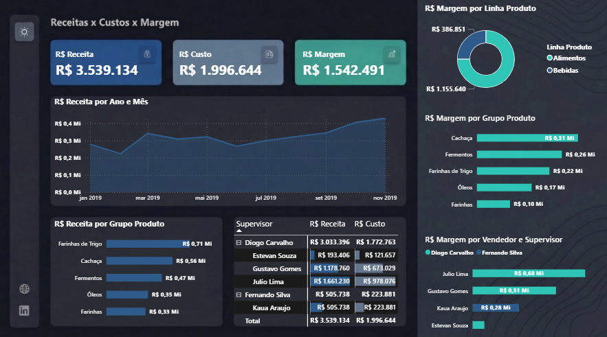

# 📊 Financial Dashboard | Power BI

## 📌 Overview
Professional financial dashboard developed in Power BI to analyze **Revenue, Cost, and Profit Margin**, providing a clear and strategic view of business performance.

---

## ❗ Business Problem
Companies often lack clear visibility into profitability across products and sales teams, making it difficult to identify inefficiencies and optimize results.

---

## 📊 Dataset
This dataset is fictional and created for analytical and portfolio purposes, simulating a retail sales scenario.

---

## 🖼️ Dashboard Preview

---

## 🎯 Objective
Provide a clear view of financial performance by analyzing revenue, cost, and profitability across products and sales teams.

---

## 📈 Key Insights
- Achieved a **43% overall profit margin**, with higher concentration in beverage products  
- Revenue shows a **consistent upward trend**  
- Performance gaps across sales teams indicate optimization opportunities  
- Revenue is highly concentrated in a small number of products  

---

## 🛠️ Tech Stack & Skills
- **Power BI:** Data visualization, interactive storytelling, and UX/UI design  
- **DAX:** Development of measures for KPIs, margins, and context-based calculations  
- **Power Query:** Data transformation, cleaning, and Star Schema modeling  
- **Excel:** Data source management  

---

## 🇧🇷 Versão em Português

## 📌 Visão Geral
Dashboard financeiro profissional desenvolvido em Power BI para analisar **Receita, Custo e Margem de Lucro**, proporcionando uma visão clara e estratégica do desempenho do negócio.

## 🎯 Objetivos e Insights
- **Saúde Financeira:** Análise de Receita Total vs. Custo Total vs. Margem  
- **Rentabilidade:** Identificação de categorias mais lucrativas (ex: bebidas com ~43%)  
- **Performance Comercial:** Identificação de gaps entre equipes de vendas  
- **Concentração de Receita:** Dependência de poucos produtos-chave  

## 💡 Impacto no Negócio
Este dashboard permite:
- Visibilidade clara da performance financeira  
- Identificação de produtos com baixa rentabilidade  
- Tomada de decisão baseada em dados  
- Foco estratégico em lucratividade  

---

## 👤 Author

**Emerson Santos**  

Business Intelligence | Data Analysis | Power BI  

[LinkedIn](https://www.linkedin.com/in/emerson-s-8b803084/)